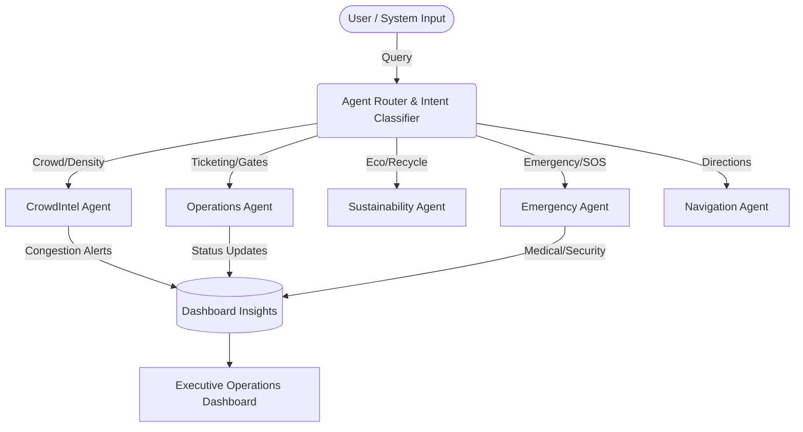

# SmartStadium 2026: Enterprise AI Operations Platform

> **GenAI-enabled solution enhancing stadium operations and the overall tournament experience for the FIFA World Cup 2026.**

 *(Note: Replace with actual screenshot)*

SmartStadium is an enterprise-grade AI Operations Platform built specifically to address the complex operational challenges of hosting the FIFA World Cup 2026. Rather than a traditional consumer app, SmartStadium leverages Generative AI and a sophisticated Multi-Agent Architecture to provide real-time decision support, crowd management, and autonomous operational intelligence for venue staff, while simultaneously providing a world-class companion experience for fans.

---

## 🏆 Challenge Alignment

This solution directly addresses the FIFA World Cup 2026 hackathon challenge:

- **Operational Intelligence & Real-time Decision Support:** Features a dedicated Executive Dashboard powered by a Multi-Agent AI system that analyzes stadium data and surfaces actionable insights (e.g., predicted congestion).
- **Crowd Management:** Live Heatmap engine simulates crowd density and automatically predicts congestion bottlenecks, calculating alternate routing in real-time.
- **Multilingual Assistance:** AI Assistant provides 10+ language native support with real-time text-to-speech for seamless global fan interaction.
- **Accessibility:** Deep commitment to a11y standards (WCAG 2.1 AA), including high-contrast mode, reduced motion, ARIA-live announcements, and dedicated `AccessibilityAgent` for wheelchair routing.
- **Sustainability:** `SustainabilityAgent` provides context-aware guidance on recycling, carbon offsetting, and eco-friendly transit options.
- **Navigation & Transportation:** Integrated Wayfinding and `TransportAgent` logic to assist with gate entry, seating, and transit logistics.

---

## 🧠 Multi-Agent AI Architecture

SmartStadium utilizes an advanced **AgentRouter** pattern. User queries and system events are classified and routed to highly specialized AI Agents, ensuring domain-expert responses rather than generic chatbot replies.



### Core Agents:
- **OperationsAgent:** Monitors general stadium status, gates, and ticketing.
- **CrowdIntelAgent:** Analyzes heatmap data to predict surges and suggest alternate routes.
- **EmergencyAgent:** Handles SOS triggers, medical queries, and security alerts.
- **SustainabilityAgent:** Promotes green initiatives and eco-friendly choices.
- **TransportAgent:** Manages ingress/egress transit coordination.

---

## 🚀 Key Features

### 1. Executive Operations Dashboard
The default landing experience provides a high-level operational overview, displaying live venue status (Capacity, Active Staff, Issues) alongside prioritized AI Insights. The AI evaluates real-time data to output specific recommendations with calculated confidence scores and impact assessments.

### 2. Live Crowd Heatmap & Prediction
A real-time canvas-based heatmap engine (`heatmap.js`) simulates zone densities. The AI Engine continuously analyzes this data to issue predictions like: *"North Concourse expected to reach 95% capacity in 15 mins. Suggest opening overflow Gate C."*

### 3. Context-Aware AI Assistant
An interactive GenAI assistant that understands stadium context (e.g., "I'm hungry" prompts the AI to recommend food stands near the user's current section). Features full voice input/output capabilities.

### 4. Smart Digital Wallet
Integrated ticket management and schedule viewing, optimized for fast scanning at the gates.

---

## 🛡️ Enterprise Security & Quality

- **XSS Prevention:** Strict adherence to security standards using `DOMPurify` for all dynamic HTML injection and Markdown rendering. Raw `innerHTML` usage is explicitly prohibited.
- **Comprehensive Testing:** Robust Jest test suite achieving high coverage across all core modules (`ai-engine`, `i18n`, `knowledge-base`, `heatmap`, `emergency`, `tickets`).
- **Performance:** Debounced event handlers, efficient `requestAnimationFrame` canvas rendering, and modular IIFE architecture to prevent global scope pollution.

---

## 🛠️ Installation & Setup

1. **Clone the repository:**
   ```bash
   git clone https://github.com/aisheth/smart-stadium-wc2026.git
   cd smart-stadium-wc2026
   ```

2. **Install testing dependencies:**
   ```bash
   npm install
   ```

3. **Run the test suite:**
   ```bash
   npm run test
   ```
   *To view coverage reports:* `npm run test:coverage`

4. **Launch the application:**
   Since this is a client-side application, simply serve the directory using any local web server (e.g., Live Server, Python `http.server`, or Node `http-server`).
   ```bash
   npx http-server .
   ```
   Navigate to `http://localhost:8080` in your browser.

---

## ⚙️ Configuration (Developer Mode)

To enable live LLM integration via Gemini (if configured in `ai-engine.js`), navigate to the Settings menu (⚙️) in the app header and input your API key under Developer Mode. The key is securely stored in local `sessionStorage`.

---
*Built for the FIFA World Cup 2026 Hackathon.*
